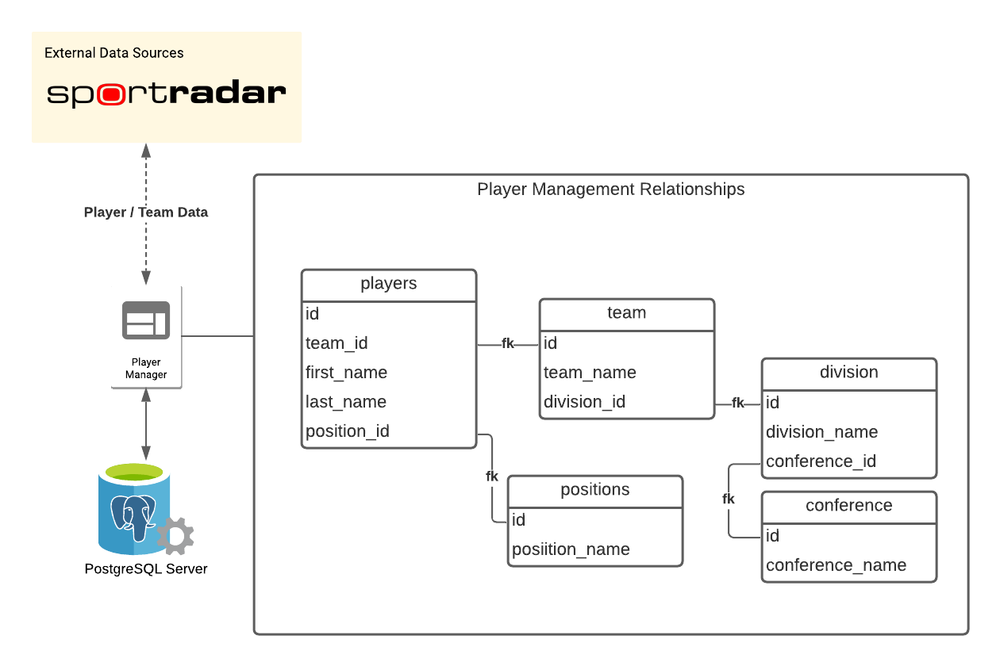

# README

Player Manager is an applicatin to allow for the management and planning of players for a fantasy football league.

The overall idea behind this app is demonstrated in the following diagram: 

This rails application has the following dependencies

* sportradar.com api key
* ruby version 3.0.3
* rails 7
